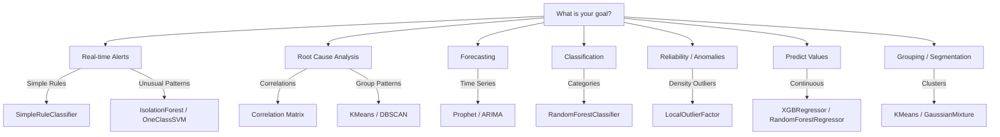

# Comprehensive Model Usage Guide

This guide provides step-by-step instructions for using every model supported by the MLOps Pipeline.

## Model Selection Flowchart

Use this decision tree to choose the right model for your goal:

## 1. Classification (Supervised)
**Goal**: Predict categories (e.g., Spam/Not Spam, Good/Bad Air Quality).

### Supported Models
*   **RandomForestClassifier** (Robust, general purpose)
*   **LogisticRegression** (Simple, interpretable)
*   **SimpleRuleClassifier** (Define your own IF/THEN rules)
*   **XGBClassifier / LGBMClassifier / CatBoostClassifier** (High performance)
*   **SVC, KNeighborsClassifier, DecisionTreeClassifier, etc.**

### How to Use
1.  **Preprocessing Step**:
    *   **Target Column**: Enter the name of the column you want to classify (e.g., `aqi_category`).
    *   *Note*: The system will automatically encode text labels (e.g., "Good", "Bad") into numbers.
2.  **Training Step**:
    *   **Task Type**: Select `Classification`.
    *   **Model Name**: Choose your model (e.g., `RandomForestClassifier`).
3.  **Output**:
    *   Predictions will be class labels (e.g., 0, 1 or "Good", "Bad" depending on encoding).
    *   Metrics: Accuracy, Precision, Recall, F1-Score.

---

## 2. Regression (Supervised)
**Goal**: Predict continuous numbers (e.g., House Price, AQI Value).

### Supported Models
*   **RandomForestRegressor**, **LinearRegression**, **Ridge**, **Lasso**, **ElasticNet**
*   **XGBRegressor**, **LGBMRegressor**, **CatBoostRegressor**
*   **SVR**, **KNeighborsRegressor**

### How to Use
1.  **Preprocessing Step**:
    *   **Target Column**: Enter the name of the numeric column (e.g., `aqi`).
    *   *Note*: The system **automatically scales** this target for better training.
2.  **Training Step**:
    *   **Task Type**: Select `Regression`.
    *   **Model Name**: Choose your model (e.g., `XGBRegressor`).
3.  **Prediction Step**:
    *   **Result**: The system **automatically converts** the predictions back to the real scale (e.g., you will see AQI 75, not 0.023).

---

## 3. Time Series Forecasting
**Goal**: Predict future values based on past trends + date.

### Supported Models
*   **Prophet** (Facebook's model, handles seasonality/holidays well)
*   **ARIMA / SARIMA** (Statistical standard)

### How to Use
1.  **Preprocessing Step**:
    *   **Target Column**: The value to forecast (e.g., `aqi`).
    *   **Timestamp Column**: (CRITICAL) Name of your date column (e.g., `dateissuedutc` or `timestamp`).
    *   **Forecasting Horizons**: (Optional) e.g., `6h, 1d` to generate future rows.
2.  **Training Step**:
    *   **Task Type**: Select `Time Series`.
    *   **Model Name**: `Prophet` or `ARIMA`.
3.  **Requirements**:
    *   Your data **must** have a valid date/time column.
    *   **Prophet** specifically looks for columns named `ds`, `date`, `timestamp`, or `dateissuedutc`.

---

## 4. Anomaly Detection (Unsupervised)
**Goal**: Find rare/weird data points (Outliers).

### Supported Models
*   **IsolationForest** (Best general purpose)
*   **OneClassSVM** (Good for finding novelty)
*   **LocalOutlierFactor** (Good for density-based outliers)

### How to Use
1.  **Preprocessing Step**:
    *   **Target Column**: **LEAVE EMPTY**. (Or set to `None`).
    *   *Note*: Unsupervised tasks learn from features only.
2.  **Training Step**:
    *   **Task Type**: Select `Anomaly Detection` (or `Unsupervised`).
    *   **Model Name**: Select `IsolationForest` or others.
3.  **Output**:
    *   **-1**: Anomaly / Outlier.
    *   **1**: Normal Data.
    *   useful for alerting on strange sensor readings.

---

## 5. Clustering (Unsupervised)
**Goal**: Group similar data points together.

### Supported Models
*   **KMeans** (Standard grouping)
*   **DBSCAN** (Density-based, finds arbitrary shapes)
*   **GaussianMixture** (Probabilistic)

### How to Use
1.  **Preprocessing Step**:
    *   **Target Column**: **LEAVE EMPTY**.
2.  **Training Step**:
    *   **Task Type**: Select `Clustering`.
    *   **Model Name**: `KMeans`.
    *   **Params**: Set `n_clusters` (e.g., `3`).
3.  **Output**:
    *   **Prediction**: A number representing the group ID (0, 1, 2...).

---

## 6. Deep Learning
**Goal**: Complex patterns using Neural Networks.

### Supported Models
*   **DNN (MLP)**: Dense Neural Network for tabular classification/regression.
*   **LSTM**: For Time Series / Sequential data.
*   **CNN**: For spatial patterns in data.

### How to Use
1.  **Preprocessing Step**:
    *   **Target Column**: Required.
2.  **Training Step**:
    *   **Task Type**: Select `Deep Learning`.
    *   **Model Name**: `DNN (MLP)` is best for standard data.
    *   **Params**: `epochs` (e.g. 10), `batch_size` (e.g. 32).
